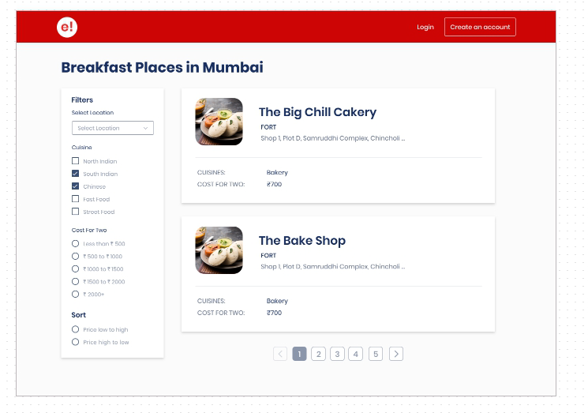

# Adding a Simple Static Webpage for Search for Restaurants (assignment-1-gopikris)

This repo is to develop a small restaurant search portal that looks like below

This exercise helps understand the following concepts
HTML(divs), CSS(inline, external), anchor (with target options), link, background, border, margin, padding, etc.
